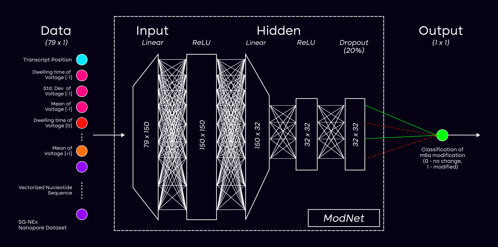
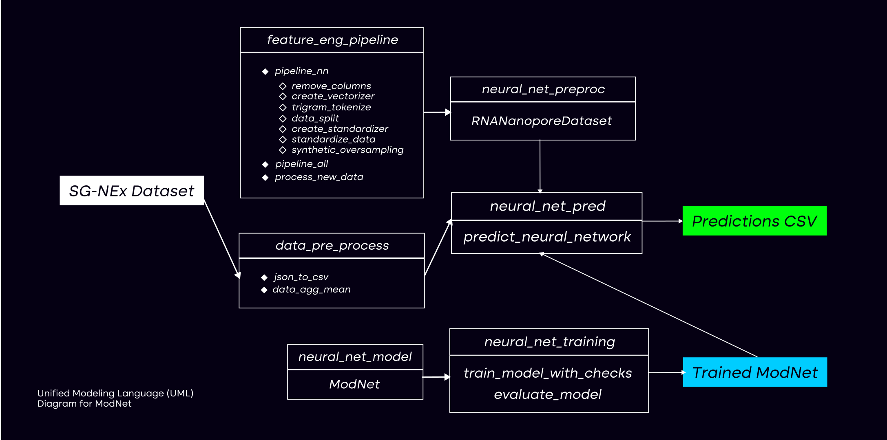

# helix4262 Neural Network Model: ModNet

`ModNet` is a `pytorch` neural network model that was derived from the model architecture defined by `m6anet` and developed by our team for detecting m6a RNA modifications in the SG-Nex dataset. 

## Network Architecture



## Folder Structure

```
.
├── code/
│   ├── data_preparators
│   │   ├── standardizer.joblib
│   │   └── vectorizer.joblib
│   ├── models/
│   │   ├── state
│   │   └── model.pth
│   ├── README.md
│   ├── data_pre_process.py
│   ├── neural_net_model.py
│   ├── neural_net_pred.py
│   ├── neural_net_preproc.py
│   ├── neural_net_training.py
│   ├── neural_net_training_w_EarlyStopping.py
│   ├── random_forest_model.py
│   └── xg_boost_model.py
```



## Downloading the Dataset

Before training the model, create a folder named `dataset` using the following command while still in the `helix4262` folder:

```bash
mkdir dataset
```

If you are using a local machine to train the model, make sure to install the AWS CLI before downloading the dataset. Instructions may be found [here](https://docs.aws.amazon.com/cli/latest/userguide/getting-started-install.html#:~:text=Run%20the%20install%20program.,write%20permissions%20to%20those%20directories.).

Download the SG-Nex RNA sequence dataset into the folder using the following command: 

```bash
aws s3 cp --no-sign-request s3://sg-nex-data/data/processed_data/m6Anet/SGNex_A549_directRNA_replicate5_run1/data.json dataset
```

## Training the Model

Ensure that you are in the `helix4262/code` folder before continuing with training the model.

If you are currently in the `helix4262` folder, you can run the command below to change directory into the `code` folder to run the scripts for training and predicting.

```bash
cd code
```

To train the model, you can pass in relevant arguments into the `neural_net_training` module and a newly instantiated model will be trained.

You can run the following command to find out the parameters that can be passed into the training the neural network.

```bash
# windows
python -m neural_net_training --help

# macOS
python3 -m neural_net_training --help
```

## Flags for Training Model

**Required Arguments**: These arguments needs to be passed in for the program to run.

| Short Flag | Long Flags  | Description                                                           |
|------------|-------------|-----------------------------------------------------------------------|
| -dp        | --data-path | Full path to the .csv file including features and labels for training |

**Optional Arguments**: These arguments do not need to be passed in for the program to run, as there are default arguments passed in for the program to work with them. These arguments can be specified at the discretion of the user.

| Short Flag | Long Flags         | Description                                                                                                            | Default                                | Datatype |
|------------|--------------------|------------------------------------------------------------------------------------------------------------------------|----------------------------------------|----------|
| -ts        | --train-size       | Proportion of dataset used for training. Should be a float between 0 and 1.                                            | 0.8                                    | float    |
| -ne        | --num-epochs       | Number of epochs used for training.                                                                                    | 10                                     | int      |
| -lr        | --learning-rate    | Learning rate for training the neural network.                                                                         | 0.001                                  | float    |
| -bs        | --batch-size       | Number of datapoints in each batch used to train the neural network.                                                   | 256                                    | int      |
| -msd       | --modelstate-dict  | Full filepath to where we want to store the model state                                                                | ./models/state/model.pth               | str      |
| -cpd       | --checkpoint-dict  | Full filepath to the checkpoint dictionary, this is required if you want to continue training from the previous round. | None                                   | str      |
| -vp        | -vectorizer-path   | Full filepath to where we want to store the trained vectorizer.                                                        | ./data_preparators/vectorizer.joblib   | str      |
| -sp        | -standardizer-path | Full filepath to where we want to store the trained standardizer.                                                      | ./data_preparators/standardizer.joblib | str      |

### Run Training with Sample Dataset 

To train a new `ModNet` model using the preprocessed sample dataset provided on SG-NEx, run the following command:

```bash
# assume that the JSON data has been preprocessed
python -m neural_net_training --data-path ../dataset/data.csv
```

## Predictions using Model

### Change Directory (if required)
Ensure that you are in the `helix4262/code` folder before continuing with predictions using the model.

If you are currently in the `helix4262` folder, you can run the command below to change directory into the `code` folder to run the scripts for training and predicting.

```bash
cd code
```
To train the model, you can pass in relevant arguments into the `neural_net_pred` module and the model specified will be used to create predictions of m6a modification on the specified dataset.

You can run the following command to find out the parameters that can be passed into the creating predictions using a specified model and dataset:

```bash
# windows
python -m neural_net_pred --help

# macOS
python3 -m neural_net_pred --help
```

### Flags for Making Predictions using Model (TBC)

**Required Arguments**: These arguments needs to be passed in for the program to run.

| Short Flag | Long Flag        | Description                                 |
|------------|------------------|---------------------------------------------|
| -dj        | --data-json-path | Path to direct RNA-Seq data in JSON format. |

**Optional Arguments**: These arguments do not need to be passed in for the program to run, as there are default arguments passed in for the program to work with them. These arguments can be specified at the discretion of the user.

| Short Flag | Long Flag           | Description                                                       | Default                                | Datatype |
|------------|---------------------|-------------------------------------------------------------------|----------------------------------------|----------|
| -msd       | --modelstate-dict   | Filepath where model state (trained model) is stored.             | ./models/state/model.pth               | str      |
| -vp        | --vectorizer-path   | Full filepath to where we want to store the trained vectorizer.   | ./data_preparators/vectorizer.joblib   | str      |
| -sp        | --standardizer-path | Full filepath to where we want to store the trained standardizer. | ./data_preparators/standardizer.joblib | str      |
| -pp        | --prediction-path   | Filepath to store predictions in CSV format.                      | ./prediction/predict_on_datafile.csv   | str      |

### Run Training with Sample Dataset 

To predict m6a modifications on the dataset, run the following command in `bash`:

```bash
python3 -m neural_net_pred -dj "../dataset/data.json"
```
